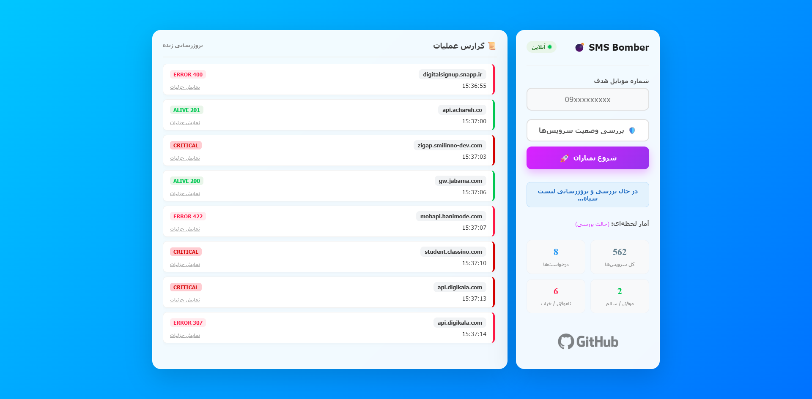

<div align="center">

  <h1 align="center">💣 SMS Bomber Ultimate</h1>
  <p align="center">
    <b>قدرتمندترین ابزار تست نفوذ و بررسی فشار پیامکی (SMS Stress Testing)</b><br>
    طراحی شده با PHP و رابط کاربری مدرن
  </p>

  <p align="center">
    <!-- Stars -->
    <a href="https://github.com/mohamadahmadi/iran-sms-bomber/stargazers">
      
    </a>
    <!-- Forks -->
    <a href="https://github.com/mohamadahmadi/iran-sms-bomber/network/members">
      
    </a>
    <!-- Issues -->
    <a href="https://github.com/mohamadahmadi/iran-sms-bomber/issues">
      
    </a>
    <!-- License -->
    <a href="https://github.com/mohamadahmadi/iran-sms-bomber/blob/main/LICENSE">
      
    </a>
  </p>
  
  <p align="center">
    <!-- Repo Size -->
    
    <!-- Last Commit -->
    <a href="https://github.com/mohamadahmadi/iran-sms-bomber/commits/main">
      
    </a>
    <!-- Language -->
    
  </p>
  
  <p align="center">
    <a href="#features">ویژگی‌ها</a> •
    <a href="#installation">نصب و اجرا</a> •
    <a href="#responsibility">سلب مسئولیت</a>
  </p>
</div>

---

## 🚀 معرفی پروژه (Introduction)
این پروژه یک ابزار پیشرفته برای تست سرویس‌های پیامکی (SMS OTP) است. با استفاده از این ابزار می‌توانید پایداری و امنیت سرویس‌های ارسال پیامک خود را در برابر درخواست‌های مکرر بررسی کنید. تمامی سرویس‌های موجود در `services.php` به‌روزرسانی شده و دارای قابلیت **بررسی سلامت خودکار** هستند.

### ✨ ویژگی‌های کلیدی (Key Features)

- **رابط کاربری مدرن:** طراحی Glassmorphism با انیمیشن‌های جذاب و ریسپانسیو.
- **پشتیبانی کامل از زبان فارسی:** همه متون و اعداد با فونت زیبای **وزیرمتن (Vazirmatn)** نمایش داده می‌شوند.
- **سیستم هوشمند بررسی سلامت (Health Check):**
  - تشخیص خودکار سرویس‌های غیرفعال (Dead Services).
  - حذف خودکار سرویس‌های از کار افتاده از لیست ارسال.
  - مدیریت هوشمند بلک‌لیست برای جلوگیری از اتلاف زمان.
- **آمار لحظه‌ای (Real-time Stats):**
  - نمایش تعداد کل سرویس‌ها، درخواست‌های موفق، ناموفق و پنل لاگ زنده.
- **معماری ماژولار:**
  - جداسازی منطق ارسال (`sms.php`) از لیست سرویس‌ها (`services.php`).
- **سرعت بالا:** استفاده از cURL Multi-threading برای ارسال همزمان درخواست‌ها.

---

## 🛠 نصب و اجرا (Installation)

### پیش‌نیازها
- **PHP** نسخه 7.4 یا بالاتر.
- وب‌سرور (Apache یا Nginx) - پیشنهاد ما استفاده از **Laragon**, **XAMPP** یا **WAMP** است.

### مراحل نصب
1. مخزن را کلون کنید:
   ```bash
   git clone https://github.com/mohamadahmadi/iran-sms-bomber.git
   ```
2. وارد پوشه پروژه شوید:
   ```bash
   cd iran-sms-bomber
   ```
3. سرور را اجرا کنید (اگر از PHP Built-in Server استفاده می‌کنید):
   ```bash
   php -S localhost:8000
   ```
4. مرورگر خود را باز کنید و به آدرس `http://localhost:8000` بروید.

---

## 🖥 نحوه استفاده (Usage)

1. **شماره موبایل** هدف را وارد کنید (فرمت: `09xxxxxxxxx`).
2. بر روی دکمه **شروع بمباران 🚀** کلیک کنید.
3. برای پاکسازی لیست سرویس‌ها از موارد خراب، دکمه **بررسی وضعیت سرویس‌ها 🛡️** را بزنید.

<br>

<div align="center">
  
  
</div>

---

## ⚠️ سلب مسئولیت (Disclaimer)

این ابزار **صرفاً برای اهداف آموزشی و تست نفوذ قانونی (Pentesting)** طراحی شده است.
- توسعه‌دهنده هیچ‌گونه مسئولیتی در قبال استفاده نادرست، غیرقانونی یا مخرب از این ابزار ندارد.
- هرگونه ایجاد مزاحمت برای دیگران با استفاده از این ابزار، خلاف قوانین و اخلاق است.
- مسئولیت استفاده از این کد مستقیماً بر عهده کاربر است.

---

## 🤝 مشارکت (contribution)
اگر سرویس جدیدی دارید یا باگی پیدا کردید، خوشحال می‌شویم که **Pull Request** ارسال کنید یا در بخش Issues مطرح نمایید.

<div align="center">
  <sub>Made with ❤️ & PHP by <a href="https://github.com/mohamadahmadi">Mohamad Ahmadi</a></sub>
</div>
